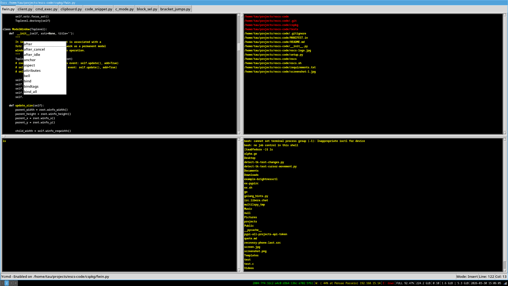

Escs
====

A modal Editor/IDE written in Python/Tk.

Escs is an IDE in the style of Emacs/Vim in the sense it doesn't demand you to use
a mouse. It was built with some goals, it should be easily extensible; users should extend Escs
in a mainstream programming language (Escs uses Python to be extended and configured);  

Escs doesn't demand you to have twenty three fingers for using it but makes you feel 
like having twienty three fingers in your hands.

The Syntax Highlighter plugin makes it easy to create new themes it supports several languages.
It uses Pygments library to perform highlighting of code.

There are several built-in modes for programming languages like Python, Golang, Javascript ...
Users can create their own tools over these modes to execute their tasks/operations.

Escs integrates with Ycmd to do code completion it is simple to use other type 
of engines to perform several tasks.

Escs has an optmized scheme of keystrokes/operations it has a concept for organizing 
keystrokes and operations it has single major mode and several minor momdes 
(e.g Normal, Insert, Python, Extra, Golang).

Keystrokes for operations that are often used and common when working with a text editor 
are implemented in Main mode (i.e The single major mode it has), such keystrokes are meant to be 
major keystrokes or primary ones (e.g  tabs management, open/save files, splits management).

Escs has a built-in file manager it is handy to inspect directories, files and even organize stuff.
It also has integration with searching tools, It is quick to find files based either on its content
or path name pattern.

Escs has a built-in plugin to implement tools that demand working with pipes or sockets. 
It even has a built irc client. 

Users can spawn processes like bash, python then send and receive data as in a terminal-like manner.

Features/Plugins
================

- **Python PDB Debugger**

- **Golang Delve Debugger**
    * https://github.com/go-delve/delve

- **GDB Debugger**

- **Nodejs inspect Debugger**

- **Rope Refactoring Tools**
    * https://github.com/python-rope/rope

- **Incremental Search**

- **Python Pyflakes Integration**
    * https://github.com/PyCQA/pyflakes

- **Tabs/Panes**

- **Self documenting**

- **Syntax Highlighter for 300+ languages**

- **Handy Shortcuts**

- **Ycmd Auto Completion**
    * https://github.com/ycm-core/ycmd

- **Quick Snippet Search**

- **The Silver Searcher**
    * https://github.com/ggreer/the_silver_searcher

- **File Manager**

- **Python Static Type Checker**
    * http://mypy-lang.org/

- **Terminal-like**

- **Irc Client Plugin**

- **Find Function/Class Definition**

- **Python Vulture Integration**
    * https://github.com/jendrikseipp/vulture

- **Python Auto Completion**
    * https://github.com/davidhalter/jedi

Install
=======

~~~
pip install escs
~~~

