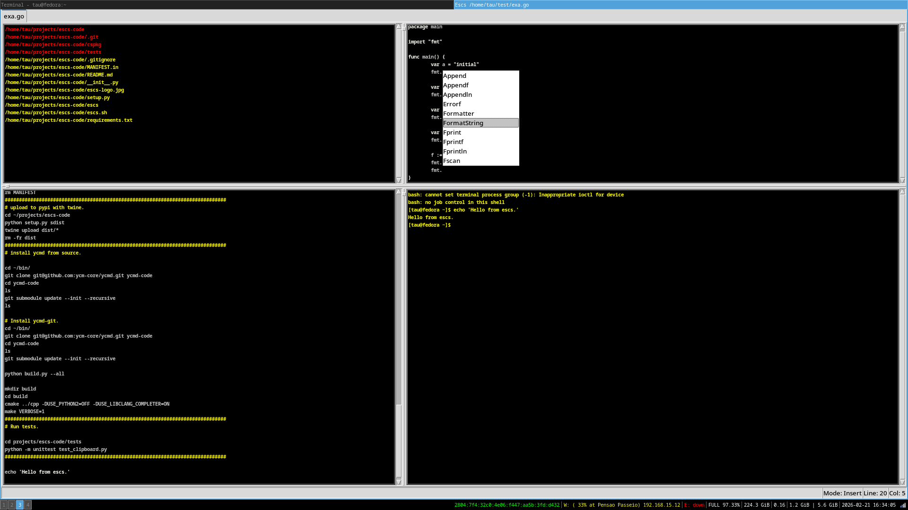

Escs
====

A modal Editor/IDE written in Python/Tk.

Escs is an IDE in the style of Emacs/Vim in the sense it doesn't demand you to use
a mouse. It was built with some goals, it should be easily extensible; users should extend Escs
in a mainstream programming language (Escs uses Python to be configured);  it should make one feel like 
having twenty three fingers on its two hands.

The Syntax Highlighter plugin makes it easy to create new themes it supports several languages.
It uses Pygments library to perform highlighting of code.

There are several built-in modes for programming languages like Python, Golang, Javascript ...
Users can create their own tools over these modes to execute their tasks/operations.

Escs integrates with Ycmd to do code completion it is simple to use other type of engines to perform
several tasks.

It also has the concept of primary keystrokes that implement common functionalities to all 
other modes (i.e minor modes). Such an approach spares a lot of keystrokes.

Features/Plugins
================

- **Python PDB Debugger**

- **Golang Delve Debugger**
    * https://github.com/go-delve/delve

- **GDB Debugger**

- **Nodejs inspect Debugger**

- **Rope Refactoring Tools**
    * https://github.com/python-rope/rope

- **Incremental Search**

- **Python Pyflakes Integration**
    * https://github.com/PyCQA/pyflakes

- **Tabs/Panes**

- **Self documenting**

- **HTML Tidy Integration**
    * http://tidy.sourceforge.net/

- **Syntax Highlighter for 300+ languages**

- **Handy Shortcuts**

- **Ycmd Auto Completion**
    * https://github.com/ycm-core/ycmd

- **Quick Snippet Search**

- **The Silver Searcher**
    * https://github.com/ggreer/the_silver_searcher

- **File Manager**

- **Python Static Type Checker**
    * http://mypy-lang.org/

- **Terminal-like**

- **Irc Client Plugin**

- **Find Function/Class Definition**

- **Python Vulture Integration**
    * https://github.com/jendrikseipp/vulture

- **Python Auto Completion**
    * https://github.com/davidhalter/jedi

Install
=======

~~~
pip install escs
~~~

